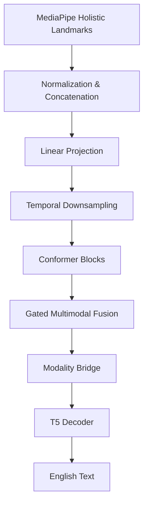

# Gloss-Free ASL-to-English Translation

A deep learning framework to translate American Sign Language (ASL) video coordinates directly into fluent English sentences without using intermediate gloss representations. The project connects a custom **Conformer Encoder** directly to a pretrained **Hugging Face T5 Decoder** (supporting `t5-small` or `t5-base`) to perform end-to-end visual-to-text sequence generation. It also optionally incorporates precomputed spatiotemporal features (e.g. from an **I3D network**) via a **Gated Multimodal Fusion** mechanism.

## Motivation

This is a solo project aimed at building a gloss-free ASL-to-English translation system using only Kaggle GPUs. The primary focus is on clean engineering, robust pipeline architecture, and practical implementation over immediate state-of-the-art academic metrics. It serves to demonstrate end-to-end deep learning engineering capabilities, from custom PyTorch dataloaders for geometric normalization to seamlessly bridging visual Conformer blocks with pretrained text decoders.

## Demo

*(Placeholder: Hugging Face Spaces Gradio App Link will be added here once training is fully complete and the model is deployed.)*

## Results

*(Placeholder: BLEU-4 and WER metrics on the validation splits will be reported here after the full training run completes.)*

## Architecture



### 1. Robust Coordinates Processing Pipeline
* **Targeted Landmark Extraction (`src/data_pipeline.py`)**: Uses MediaPipe to extract keypoints across Pose, Face, and Hands. Slices face landmarks to an optimized **92-point facial subset** (eyebrows, eyes, lips) instead of the full 468 points, reducing coordinate dimensionality by **80%** (from 1404 to 276 dimensions) while preserving critical grammatical facial expressions.
* **Scale & Distance Invariance (`src/dataset.py`)**: Coordinates are geometrically normalized to ensure model invariance to camera distance, signer height, and camera movement.
* **How2Sign MediaPipe & I3D Support (`src/dataset.py`)**: Custom dataset loader to dynamically load pre-extracted MediaPipe Holistic `.npy` landmark files and align them with precomputed 1024-dimensional dense spatiotemporal I3D feature vectors.
* **Data Augmentations**: Evaluates coordinate stability during training using random horizontal mirroring (reversing coordinates and swapping symmetric joints and left/right hands), temporal frame-level jittering (random drop/duplicate), and hand dropout.

### 2. High-Performance Model Architecture
* **Hybrid Conformer Encoder (`src/models/manual_encoder.py`)**: Combines multi-head self-attention (global context) with convolutional blocks (local movement details) in 4 Conformer blocks (`d_model=512`, `heads=4`, `kernel_size=31`).
* **Learnable Temporal Downsampling**: Uses a strided convolutional layer (`stride=2`) rather than max-pooling, allowing the encoder to learn downsampling while retaining continuous movement trajectories.
* **Rigorous Padding Fixes**: Implements `LayerNorm` (with transpose) instead of standard `BatchNorm1d` within Conformer blocks. This prevents padded zero-tokens in variable-length sequences from biasing batch normalization statistics.
* **Gated Multimodal Fusion**: Projects and fuses spatiotemporal video features (1024-dim I3D features) with Conformer visual features via a learnable gating channel to dynamically combine structural coordinates and contextual pixel features.
* **Seamless T5 Cross-Attention Wrapper (`src/train.py`)**: Routes Conformer visual outputs directly to the cross-attention layers of the T5 decoder, bypassing the T5 text encoder completely.

<details>
<summary>Mathematical Formulation of Coordinate Normalization</summary>

To achieve scale and camera distance invariance, frame-level landmarks are normalized as follows:

1. **Mid-Shoulder Centering ($p_{\text{mid-shoulder}}$)**:
   $$p_{\text{mid-shoulder}} = \frac{p_{\text{shoulder1}} + p_{\text{shoulder2}}}{2}$$
   $$w_{\text{shoulder}} = \begin{cases} \|p_{\text{shoulder1}} - p_{\text{shoulder2}}\|_2, & \text{if } \|p_{\text{shoulder1}} - p_{\text{shoulder2}}\|_2 \ge 0.05 \\ 0.25, & \text{otherwise} \end{cases}$$
   
   *For MediaPipe inputs, shoulders are indices `11` and `12`.*

2. **Pose Coordinate Normalization ($p_{\text{norm}}$)**:
   $$p_{\text{norm}} = \frac{p - p_{\text{mid-shoulder}}}{w_{\text{shoulder}}}$$

3. **Hand Coordinate Normalization ($h_{\text{norm}}$)**:
   Hands are centered relative to their respective wrist joint ($w_{\text{wrist}}$, index `0` of the hand stream):
   $$h_{\text{norm}} = \frac{h - w_{\text{wrist}}}{w_{\text{shoulder}}}$$

4. **Face Coordinate Normalization ($f_{\text{norm}}$)**:
   Face coordinates are centered relative to the facial bounding centroid ($c_{\text{face-centroid}}$):
   $$f_{\text{norm}} = \frac{f - c_{\text{face-centroid}}}{w_{\text{shoulder}}}$$

</details>

### 3. Leak-Free Evaluation and Dataset Auditing
* **Signer-Based Splits**: Automatically parses metadata manifests to separate training, validation, and test splits by uploader/channel ID. This guarantees that validation metrics are evaluated on unseen signers, preventing signer data leakage.
* **Fast Profiler (`src/validate_dataset.py`)**: Evaluates landmark quality (sequence length distribution, hand/face tracking dropout percentages, and frame-to-frame wrist jitter noise) on large directories in seconds using non-recursive directory lists.

### Feature Dimension Breakdown
The feature vectors are concatenated per frame into a single 1D tensor:

#### MediaPipe Holistic Format (e.g. How2Sign or YouTube-ASL)
* **Face Enabled (Default)**: **501 dimensions** (when loaded from pre-extracted `.npy` files) or **534 dimensions** (when loaded from `.npz` files).
  * `.npy` files: $\text{Pose (} 33 \times 3 = 99\text{)} + \text{Left Hand (} 21 \times 3 = 63\text{)} + \text{Right Hand (} 21 \times 3 = 63\text{)} + \text{Face (} 92 \times 3 = 276\text{)} = 501\text{ dims}$
  * `.npz` files: $\text{Pose (} 33 \times 4 = 132\text{)} + \text{Left Hand (} 21 \times 3 = 63\text{)} + \text{Right Hand (} 21 \times 3 = 63\text{)} + \text{Face (} 92 \times 3 = 276\text{)} = 534\text{ dims}$
* **Face Disabled (`--no_face`)**: **225 dimensions** (for `.npy` files) or **258 dimensions** (for `.npz` files).

## Setup & Usage

### Project Structure

```bash
├── .github/               # GitHub configurations (CI/CD workflows)
├── data/                  # Local directory for mock/active landmarks (.npz files)
├── results/               # Training checkpoints and output logs
├── scripts/               # Testing, evaluation, and profiling utilities
│   ├── check_environment.py # Environment setup and GPU capability checker
│   ├── evaluate.py        # Quantitative evaluation script (BLEU-4 and WER)
│   ├── export_onnx.py     # Conformer encoder ONNX export utility
│   ├── inference.py       # Standalone landmark-to-English translation inference script
│   └── profile_memory.py  # GPU memory estimator for small/base T5 decoders
├── src/                   # Main source code
│   ├── models/            # Neural network architectures
│   │   ├── __init__.py    # Models package entry point
│   │   ├── manual_encoder.py # Conformer Encoder implementation
│   │   └── translation_model.py # Combined Conformer-T5 architecture
│   ├── utils/             # Helper utilities
│   │   ├── __init__.py    # Utils package entry point
│   │   ├── io_utils.py    # Shared JSON and directory loading utilities
│   │   ├── metadata.py    # CSV/TSV metadata parsing logic
│   │   └── splits.py      # Signer-independent splitting logic
│   ├── data_pipeline.py   # MediaPipe extractor and formatter
│   ├── dataset.py         # LandmarkDataset & collators (MediaPipe Holistic + I3D)
│   ├── train.py           # Thin orchestrator script for model training
│   └── validate_dataset.py # Statistics and noise validation script
├── tests/                 # Unit and integration tests (using pytest)
│   ├── conftest.py        # Shared pytest fixtures
│   ├── test_dataset.py    # Unit tests for datasets and collations
│   ├── test_model.py      # Unit tests for translation model architecture
│   └── test_pipeline.py   # Unit tests for MediaPipe feature extraction pipeline
├── kaggle_training.ipynb  # Interactive Kaggle GPU training notebook
├── pyproject.toml         # Python package and tool configuration
├── requirements.txt       # Environment specifications
└── README.md              # Project overview
```

### Local Setup & Installation

Clone the repository and set up a virtual environment:
```bash
git clone https://github.com/yyouretoast/gloss-free-asl-translation.git
cd gloss-free-asl-translation
python -m venv .venv
```
Activate the environment:
* **Windows (PowerShell)**: `.venv\Scripts\Activate.ps1`
* **Linux/Mac**: `source .venv/bin/activate`

Install dependencies:
```bash
pip install -r requirements.txt
```

### Verify Installation
Run environment capability check:
```bash
python -m scripts.check_environment
```
Run the test suite (excluding slow integration tests by default):
```bash
pytest tests/ -v -m "not slow"
```
Run a local dry-run training pass (executes 1 epoch on mock data):
```bash
python -m src.train --epochs 1 --batch_size 2
```
Export Conformer Encoder to ONNX:

> [!NOTE]
> The Conformer encoder is exported to ONNX for efficient edge feature extraction; T5 decoding requires server-side inference (as the T5 autoregressive decoder contains dynamic loops and control flows that cannot be ONNX-traced).

```bash
# Default (501 dimensions for MediaPipe Holistic format)
python -m scripts.export_onnx

# Specify dimensions (e.g. 225 dimensions for face-disabled ablation run)
python -m scripts.export_onnx --input-dim 225
```

### Running on Kaggle

To train the model on the **How2Sign** dataset, use the provided `kaggle_training.ipynb` notebook:

1. Create a new notebook on Kaggle.
2. Add the datasets: **How2Sign Holistic** (e.g., `Pasindu Sewmuthu Abewickrama Singhe/how2sign-holistic`, 44 GB) and **How2Sign I3D Features** (e.g., `how2sign-i3d-features`, 8 GB).
   > [!WARNING]
   > Ensure both datasets are correctly attached and check for uploader/signer ID metadata inside the csv split files to avoid signer leakage.
3. Import the `kaggle_training.ipynb` file.
4. Execute the cells sequentially. The first cell will automatically pull down all the latest updates directly from this repository:
   ```python
   # Automatically clones or updates the repo to pull latest fixes
   !git pull
   ```
5. Choose your training config:
   * **Full Model (Face Enabled - 534/501 dimensions)**: Includes critical facial expressions for grammar.
   * **Ablation Model (No Face - 258/225 dimensions)**: Ignores facial expressions and trains strictly on body/hand trajectories.

### Training Options

The training entry point (`src/train.py`) supports the following customized configuration flags (all arguments accept both underscore and hyphen formats, e.g. `--data_dir` or `--data-dir`):

| Flag | Type | Default | Description |
|---|---|---|---|
| `--data_dir` | `str` | `data/landmarks` | Path to coordinate folder (.npz or .npy) |
| `--metadata_file` | `str` | `None` | Path to csv uploader metadata for signer-leak proof splits |
| `--epochs` | `int` | `10` | Total training epochs |
| `--batch_size` | `int` | `8` | Size of training batches |
| `--lr` | `float` | `1e-4` | Learning rate |
| `--output_dir` | `str` | `results/checkpoints` | Path to folder where training checkpoints are saved |
| `--no_face` | `bool` | `False` | Disables face landmarks to study coordinate ablation (reduces dims) |
| `--max_len` | `int` | `150` | Maximum frame sequence length (caps longer sequences to prevent OOM) |
| `--max_target_len` | `int` | `30` | Maximum target text sequence token length |
| `--resume_from_checkpoint` | `str` | `None` | Path to checkpoint directory to resume from, or `'latest'` to auto-detect |
| `--t5_model` | `str` | `t5-small` | Hugging Face T5 decoder checkpoint (`t5-small` or `t5-base`) |
| `--i3d_dir` | `str` | `None` | Path to precomputed I3D features directory (enables Multi-Stream Gated Fusion) |
